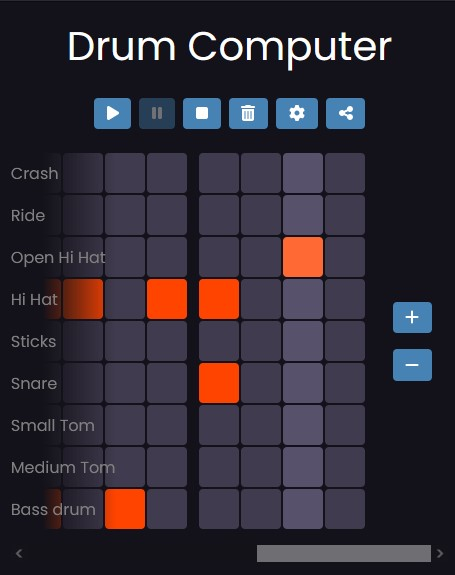

# Drum Computer

> https://drumcomputer.netlify.app/

## Summary

This is a drum computer in the browser. It is supposed to be accessible to anyone, even without any knowledge about music.

## Features

Each row in the timeline represents an instrument (like bass drum, snare, etc.) within a drumset. You can simply add or remove notes by clicking on the respective buttons in the timeline. The playback function gives you immediate feedback how the beat sounds like. For reasons of a11y, keyboard navigation is fully supported.

The timeline is divided into beats. Their number can be adjusted via the buttons to the right of the timeline. By default, the number of subdivisions per beat is 4. But this can be adjusted in the settings page, which can be opened via the top menu. There you can also toggle timeline scrolling and change the speed of the beat.

The app also lets you share your track with others via a link. When this link is opened, it loads the track saved in the URL parameters. Thus, the sharing function does not require any database (and saves resources and code). You can find some examples here: [tracks.md](./tracks.md)

On startup, the app always loads an example track (which can then be edited). But you can just save your favorite tracks as bookmarks in the browser, using the sharing function described above.

## Limitations

Of course, the app can also be opened and used on mobile. However, some mobile browsers do not play the notes in a regular way. Maybe I can fix this issue in the future. You will also face some issues when the speed is set very high. This can be remedied by using a higher default channel number in the `AudioPlayer` class.

## Stack

This is a single page application made with [Svelte](https://svelte.dev) and [TypeScript](https://www.typescriptlang.org).

## Credits

The sound effects come from https://www.fesliyanstudios.com/ and were only slightly edited.
